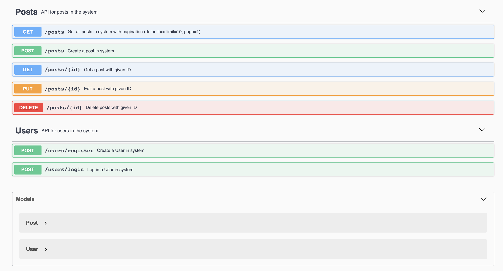
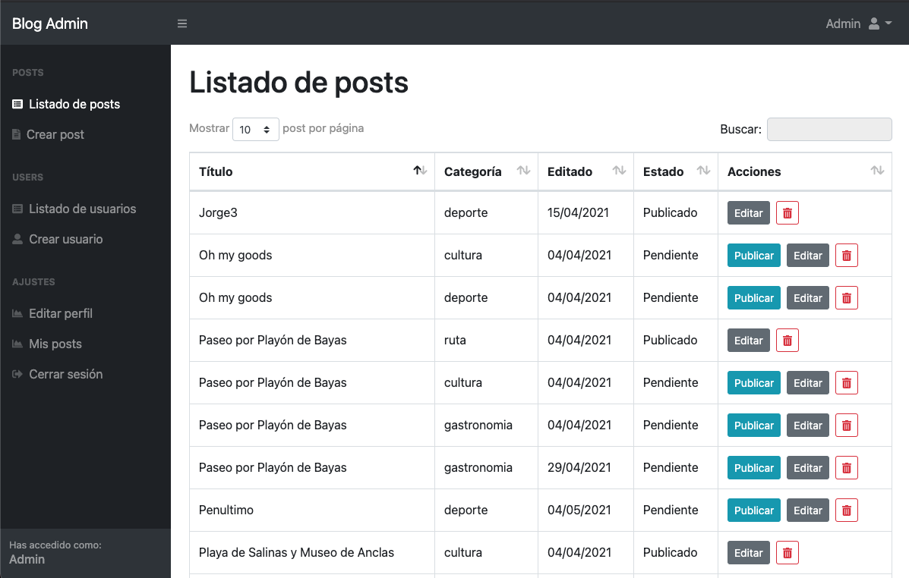

# Expedición Norte (backend)
#### This project was born from the need to group and share all those experiences and activities that can be carried out in Asturias so that other people can be inspired when it comes to getting to know this area.

## Table of contents
* [Building](#building)
* [API Docs](#api-doc)
* [Backoffice](#backoffice)
* [Technologies](#technologies)

## Building

### Requirements

_Install NodeJS and npm. You can download the installer from the following link: https://nodejs.org/es/download/_

### Installation

#### FRONTEND
_Follow the README instructions of the frontend repo: https://github.com/lele589/expedicion-norte_

#### DATABASE
_Create a database in MongoDB_

#### BACKEND
_Clone a copy of the repo:_

```
git@github.com:lele589/blog-backend.git
```
_Change to the new directory:_

```
cd blog-backend
```

_Install dependencies:_

```
npm ci
```

_Launch the project:_

```
npm run startdev
```

## API Doc
_It is used to access the information about posts and users that 'Expedición Norte' has._
```
http://your-localhost:port/api-docs/
```


## Backoffice
_It is used to manage the blog internally and to be able to access the edition and deletion of posts and users._
```
http://your-localhost:port/admin/
```



## Technologies
Project is created with:
* [NodeJs](https://nodejs.org/en/) - Version 15.11.0
* [Express](https://expressjs.com/es/) - Version 4.16.1
* [Mongoose](https://mongoosejs.com/) - Version 5.12.2
* [Pug](https://pugjs.org/api/getting-started.html) - Version 2.0.0-beta11
* [node-sass](https://www.npmjs.com/package/node-sass-middleware) - Version 5.0.0
* [Bootstrap](https://getbootstrap.com/) - Version 4.6.0
* [swagger-jsdoc](https://www.npmjs.com/package/swagger-jsdoc) - Version 6.0.0